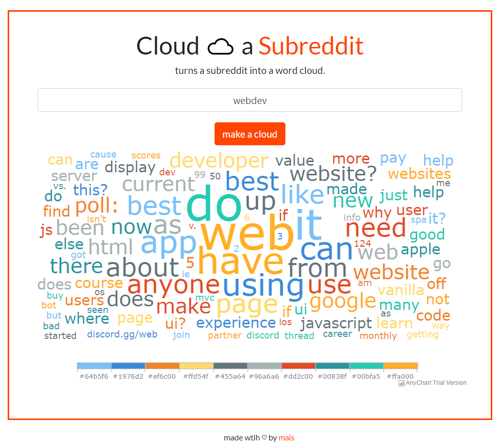

# world-cloud-subreddit
Takes the name of a subreddit, parses the post titles of the first page on that subreddit and returns them, using AnyChart, in the form of a word cloud.

### Contributors
- [@Varadpoddar](https://github.com/varadpoddar): Updated main.js to filter linking words.

### Screen of the Website

  

